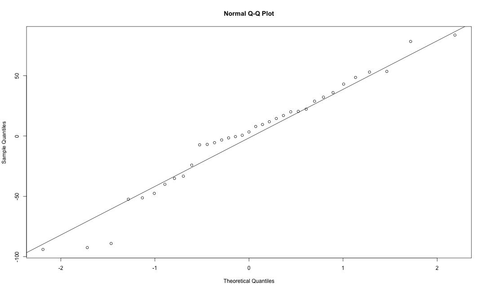

Regression Analysis On Mortality
========================================================
author: Ji Zhongce, Fu Yu
width: 1440
height: 900
date: 2017/04/20

Agenda
========================================================
Analysis on Regression Model on Mortality

- Simple Linear Regression Analysis
- Multiple Linear Regression Analysis
- Summary

Read Data
========================================================


```r
# Change the directory of data in your personal computer
Mortality_Data <- read.table("/Users/Tim/Desktop/Spring17/STAT597A/597_Final_Proj/smsa.dat", header = TRUE, na.strings = ".")
```


```r
head(Mortality_Data)
```

```
        City JanTemp JulyTemp RelHum Rain Mortality Education PopDensity
1      Akron      27       71     59   36    921.87      11.4       3243
2     Albany      23       72     57   35    997.87      11.0       4281
3  Allentown      29       74     54   44    962.35       9.8       4260
4    Atlanta      45       79     56   47    982.29      11.1       3125
5  Baltimore      35       77     55   43   1071.29       9.6       6441
6 Birmingham      45       80     54   53   1030.38      10.2       3325
  X.NonWhite X.WC     pop pop.house income HCPot NOxPot SO2Pot NOx
1        8.8 42.6  660328      3.34  29560    21     15     59  15
2        3.5 50.7  835880      3.14  31458     8     10     39  10
3        0.8 39.4  635481      3.21  31856     6      6     33   6
4       27.1 50.2 2138231      3.41  32452    18      8     24   8
5       24.4 43.7 2199531      3.44  32368    43     38    206  38
6       38.5 43.1  883946      3.45  27835    30     32     72  32
```

Clear Up Data
========================================================


```r
sum(is.na(Mortality_Data))
```

```
[1] 2
```

There we use **na.omit** method to omit the NA value


```r
Mortality_Data <- na.omit(Mortality_Data)
```


```r
sum(is.na(Mortality_Data))
```

```
[1] 0
```

Heat Map for City
========================================================
For the Heat Map for each city, we convert the data into a map and the cycle size represents the how big the number of mortality is.

In order to create Heat Map, we need to load the **leaflet** package which will help us create map, and then we use **addCircles** method to map which shows the mortality data for each city.

What's more we have also use **geocode** in the package **ggmap** to get the **lon** and **lat** value for each city.

Also we use **d3heatmap** method in package **d3heatmap** to view the data in tables with data visualization.

Both method we use to make the data shows in map or table is based on the **htmlwidgets**.

[Heat Map For Cities](http://127.0.0.1:7180)

You have to run the shinyApp to see the Heat Map for Cities

Scatterplot Matrix1
========================================================


```r
pairs(Mortality ~ JanTemp + JulyTemp + RelHum + Rain + Education, data=Mortality_Data, main="Simple Scatterplot Matrix") # Get scatter plots for mortality and each variables.
```


Scatterplot Matrix2
========================================================

```r
pairs(Mortality ~ PopDensity + X.NonWhite + X.WC + pop + pop.house, data=Mortality_Data, main="Simple Scatterplot Matrix") # Get scatter plots for mortality and each variables.
```


Scatterplot Matrix3
========================================================

```r
pairs(Mortality ~ income + HCPot + NOxPot + SO2Pot + NOx, data=Mortality_Data, main="Simple Scatterplot Matrix") # Get scatter plots for mortality and each variables.
```


Box Plot For Each Variable
========================================================

```r
Remove.Outliers <- function(Col_name){
  # First we draw the boxplot
  boxplot(Mortality_Data[,Col_name], main = Col_name)
  # Then we find the outliers
  outliers <- boxplot.stats(Mortality_Data[,Col_name])$out
  i=1
  # Change the outlier value to NA
  while(i <= length(Mortality_Data[,Col_name])){
    if(Mortality_Data[,Col_name][i] %in% outliers){
      Mortality_Data[,Col_name][i] <- NA
    }
    i <- i+1
  }
  return(Mortality_Data)
}
```

Box Plot For Each Variable
========================================================
Here we get the name for each columns

```r
col_name <- colnames(Mortality_Data)[2:17]
```

Box Plot For Each Variable
========================================================
First we will set the parameter for each box-plot so we can have a 4 by 4 matrix

```r
par(mfrow = c(4, 4))
par(mar = c(2, 2, 2, 2), mgp = c(1.8,0.8,0), oma = c(1, 1, 1, 1))
i <- 1
# use for loop to change outliers in each vairable to NA
while(i <= length(col_name)){
  Mortality_Data <- Remove.Outliers(col_name[i])
  i <- i + 1
}
```


Remove outliers For Each Variable
========================================================
Then we need to remove all the outliers for each variables

```r
sum(is.na(Mortality_Data))
```

```
[1] 55
```

There we use **na.omit** method to omit the NA value


```r
Mortality_Data <- na.omit(Mortality_Data)
```


```r
sum(is.na(Mortality_Data))
```

```
[1] 0
```

Correlation For Each Variable
========================================================
Then we create correlation matrix

```r
library(corrplot)
par(mfrow = c(1, 1))
correlation_matrix <- cor(Mortality_Data[,2:17])
corrplot(correlation_matrix, method = "circle")
```


Example For the Simple Linear Regression
========================================================

```r
fit <- lm(Mortality ~ JanTemp, Mortality_Data) # Construct a simple linear regression model.
fit # Get parameters estimates for this model.
```

```

Call:
lm(formula = Mortality ~ JanTemp, data = Mortality_Data)

Coefficients:
(Intercept)      JanTemp  
    871.042        2.259  
```

Plot Estimated Linear function
========================================================

```r
plot(x = Mortality_Data$JanTemp, y = Mortality_Data$Mortality, xlab = "JanTemp", ylab = "Mortality")
abline(fit, col = "red") # Plot the line of linear regression model for JanTemp.
```


ANOVA Table
========================================================

```r
anova(fit)
```

```
Analysis of Variance Table

Response: Mortality
          Df Sum Sq Mean Sq F value  Pr(>F)  
JanTemp    1  10527 10526.8  5.3505 0.02709 *
Residuals 33  64926  1967.5                  
---
Signif. codes:  0 '***' 0.001 '**' 0.01 '*' 0.05 '.' 0.1 ' ' 1
```

Confidence Interval
========================================================

```r
confint(fit, level = 0.90) 
```

```
                    5 %       95 %
(Intercept) 819.7226551 922.361385
JanTemp       0.6062377   3.911862
```


```r
confint(fit, level = 0.95) 
```

```
                  2.5 %     97.5 %
(Intercept) 809.3471005 932.736939
JanTemp       0.2720784   4.246021
```

Residual Plots
========================================================

```r
plot(fit$residuals, ylab = "Residual", xlab = "JanTemp") # Plot Residual vs. variable
abline(0,0, col = "red")
```


Residual Plots
========================================================

```r
plot(fit$fitted.values,fit$residuals) # Plot Residual vs. fitted value
abline(0,0, col = "red")
```


Q-Q Plots
========================================================

```r
attach(Mortality_Data) # How to get the QQ plot.
qqnorm(fit$residuals)
qqline(fit$residuals) 
```


Transformation
========================================================

```r
Mortality_Data$NOxPot
```

```
 [1] 15 10  6  8 32 12  7  8 26 21  9  4  4  3  3  3  5  7  4  7 23 11 14
[24]  3  4 11  9  4 15  1  5  7  2  2 13
```


```r
Mortality_Data$NOxPot <- sqrt(Mortality_Data$NOxPot)
```


```r
Mortality_Data$NOxPot
```

```
 [1] 3.872983 3.162278 2.449490 2.828427 5.656854 3.464102 2.645751
 [8] 2.828427 5.099020 4.582576 3.000000 2.000000 2.000000 1.732051
[15] 1.732051 1.732051 2.236068 2.645751 2.000000 2.645751 4.795832
[22] 3.316625 3.741657 1.732051 2.000000 3.316625 3.000000 2.000000
[29] 3.872983 1.000000 2.236068 2.645751 1.414214 1.414214 3.605551
```


Simple Linear Regression Analysis with transformation
========================================================

```r
fit1 <- lm(Mortality ~ NOxPot, Mortality_Data) # Construct a simple linear regression model.

fit1 # Get parameters estimates for this model.
```

```

Call:
lm(formula = Mortality ~ NOxPot, data = Mortality_Data)

Coefficients:
(Intercept)       NOxPot  
      896.3         15.2  
```

Plot Estimated Linear function
========================================================

```r
plot(x = Mortality_Data$NOxPot, y = Mortality_Data$Mortality, xlab = "NOxPot", ylab = "Mortality")
abline(fit1, col = "red") # Plot the line of linear regression model for NOxPot
```


ANOVA Table
========================================================

```r
anova(fit1) # Get ANOVA table of variables.
```

```
Analysis of Variance Table

Response: Mortality
          Df Sum Sq Mean Sq F value Pr(>F)  
NOxPot     1   9545  9545.3  4.7794  0.036 *
Residuals 33  65908  1997.2                 
---
Signif. codes:  0 '***' 0.001 '**' 0.01 '*' 0.05 '.' 0.1 ' ' 1
```


Residual Plots
========================================================

```r
plot(fit1$residuals, ylab = "Residual", xlab = "NOxPot") # Plot Residual vs. variable
abline(0,0, col = "red")
```


Residual Plots
========================================================

```r
plot(fit1$fitted.values,fit1$residuals) # Plot Residual vs. fitted value
abline(0,0, col = "red")
```


Q-Q Plots
========================================================

```r
attach(Mortality_Data) # How to get the QQ plot.
qqnorm(fit1$residuals)
qqline(fit1$residuals)
```




Multiple Linear Regression Analysis
========================================================
After we draw Q-Q plot for each variable, we find some variables can be dropped because after transformation, Q-Q plot is still straight

The rest variable will be JulyTemp, Rain, Education, PopDensity, income ,X.NonWhite, X.WC, pop.house, SO2Pot, NOxPot. And the SO2Pot and NOxPot have been transformed.

Estimated Parameter
========================================================

```r
model1 <- lm(Mortality ~ JulyTemp + Rain + Education + PopDensity + X.NonWhite + X.WC + pop.house + SO2Pot + NOxPot,data=Mortality_Data)
# This will return the coefficients for each variables
model1$coefficients
```

```
  (Intercept)      JulyTemp          Rain     Education    PopDensity 
1909.65253587   -6.17330893    1.85378690   -8.25832182    0.01057129 
   X.NonWhite          X.WC     pop.house        SO2Pot        NOxPot 
   5.76102954   -1.55985450 -163.62068898   -3.00044432   12.26535328 
```

Best Model Selection
========================================================

```r
library(MASS)
```

In the MASS library, there is a function called **stepAIC**. 

**stepAIC** is a function which will performs **Akaike Information Criterion** stepwise model selection according to specific direction such as **backward**, **forward**. 

Best Model Selection
========================================================

```r
fit3 <- lm(Mortality ~ JulyTemp + Rain + Education + PopDensity + X.NonWhite + X.WC + pop.house + SO2Pot + NOxPot,data=Mortality_Data)
step <- stepAIC(fit3, direction="both")
```

```
Start:  AIC=245.57
Mortality ~ JulyTemp + Rain + Education + PopDensity + X.NonWhite + 
    X.WC + pop.house + SO2Pot + NOxPot

             Df Sum of Sq   RSS    AIC
- SO2Pot      1     317.2 22350 244.07
- Education   1     470.8 22503 244.31
- X.WC        1     856.8 22889 244.91
- NOxPot      1    1164.0 23196 245.37
<none>                    22032 245.57
- Rain        1    2928.5 24961 247.94
- PopDensity  1    3221.9 25254 248.35
- pop.house   1    4763.2 26795 250.42
- JulyTemp    1    7539.8 29572 253.87
- X.NonWhite  1   24178.3 46211 269.50

Step:  AIC=244.07
Mortality ~ JulyTemp + Rain + Education + PopDensity + X.NonWhite + 
    X.WC + pop.house + NOxPot

             Df Sum of Sq   RSS    AIC
- Education   1     201.0 22551 242.39
- X.WC        1     920.1 23270 243.49
<none>                    22350 244.07
- NOxPot      1    1503.5 23853 244.35
+ SO2Pot      1     317.2 22032 245.57
- Rain        1    3173.4 25523 246.72
- PopDensity  1    3516.6 25866 247.19
- pop.house   1    4548.7 26898 248.56
- JulyTemp    1    7320.0 29670 251.99
- X.NonWhite  1   23935.2 46285 267.55

Step:  AIC=242.39
Mortality ~ JulyTemp + Rain + PopDensity + X.NonWhite + X.WC + 
    pop.house + NOxPot

             Df Sum of Sq   RSS    AIC
<none>                    22551 242.39
- NOxPot      1    1655.1 24206 242.87
- X.WC        1    2352.7 24903 243.86
+ Education   1     201.0 22350 244.07
+ SO2Pot      1      47.4 22503 244.31
- PopDensity  1    3637.4 26188 245.62
- Rain        1    4358.4 26909 246.57
- pop.house   1    4649.3 27200 246.95
- JulyTemp    1    7148.8 29699 250.02
- X.NonWhite  1   23753.1 46304 265.57
```

Best Model Selection
========================================================

```r
step$anova # display results
```

```
Stepwise Model Path 
Analysis of Deviance Table

Initial Model:
Mortality ~ JulyTemp + Rain + Education + PopDensity + X.NonWhite + 
    X.WC + pop.house + SO2Pot + NOxPot

Final Model:
Mortality ~ JulyTemp + Rain + PopDensity + X.NonWhite + X.WC + 
    pop.house + NOxPot

         Step Df Deviance Resid. Df Resid. Dev      AIC
1                                25   22032.31 245.5721
2    - SO2Pot  1 317.2490        26   22349.56 244.0725
3 - Education  1 200.9535        27   22550.52 242.3858
```

So we have best model with variables, **JulyTemp**, **Rain**, **PopDensity**, **X.NonWhite**, **X.WC**, **pop.house**, **NOxPot**.

Best Model Selection
========================================================

There is another package called **leaps**, **leaps** package provide many useful function including **regsubsets** that can help do Regression Subset Selection.


```r
library(leaps)
```

Here we will use **regsubsets** method which will take in a formula and the **method** attributes will decide the algorithms to use such as **exhaustive search**, **forward** or **backward stepwise**, or **sequential replacement**


```r
leaps<-regsubsets(Mortality ~ JulyTemp + Rain + Education + PopDensity + X.NonWhite + X.WC + pop.house + SO2Pot + NOxPot, method="backward", data=Mortality_Data)
```

Best Model Selection
========================================================
Then we use **summary** to get the summary of the selection

```r
# view results 
summary(leaps)
```

```
Subset selection object
Call: regsubsets.formula(Mortality ~ JulyTemp + Rain + Education + 
    PopDensity + X.NonWhite + X.WC + pop.house + SO2Pot + NOxPot, 
    method = "backward", data = Mortality_Data)
9 Variables  (and intercept)
           Forced in Forced out
JulyTemp       FALSE      FALSE
Rain           FALSE      FALSE
Education      FALSE      FALSE
PopDensity     FALSE      FALSE
X.NonWhite     FALSE      FALSE
X.WC           FALSE      FALSE
pop.house      FALSE      FALSE
SO2Pot         FALSE      FALSE
NOxPot         FALSE      FALSE
1 subsets of each size up to 8
Selection Algorithm: backward
         JulyTemp Rain Education PopDensity X.NonWhite X.WC pop.house
1  ( 1 ) " "      " "  " "       " "        "*"        " "  " "      
2  ( 1 ) " "      " "  " "       "*"        "*"        " "  " "      
3  ( 1 ) "*"      " "  " "       "*"        "*"        " "  " "      
4  ( 1 ) "*"      "*"  " "       "*"        "*"        " "  " "      
5  ( 1 ) "*"      "*"  " "       "*"        "*"        " "  "*"      
6  ( 1 ) "*"      "*"  " "       "*"        "*"        "*"  "*"      
7  ( 1 ) "*"      "*"  " "       "*"        "*"        "*"  "*"      
8  ( 1 ) "*"      "*"  "*"       "*"        "*"        "*"  "*"      
         SO2Pot NOxPot
1  ( 1 ) " "    " "   
2  ( 1 ) " "    " "   
3  ( 1 ) " "    " "   
4  ( 1 ) " "    " "   
5  ( 1 ) " "    " "   
6  ( 1 ) " "    " "   
7  ( 1 ) " "    "*"   
8  ( 1 ) " "    "*"   
```

Best Model Selection
========================================================
In Order to have a better visual understanding, we can plot the selection according to different cirterions such as **Cp**, **adjr2**, **r2** or **bic**.
Here we show the **adjr2** and **Cp**

```r
par(mfrow = c(1, 2))
plot(leaps,scale = "adjr2")
plot(leaps,scale = "Cp")
```


Best Model Selection
========================================================
Here we show the **r2** and **bic**

```r
par(mfrow = c(1, 2))
plot(leaps,scale = "r2")
plot(leaps,scale = "bic")
```


Best Model Conclusion 
========================================================
According to the best model selection, we need to select the model with largest **adjr2** and the model with cP that most close to p which is number of predictors including intercept. So according to the selection rule, we have largest **adjr2** value is 0.62 and the model is **JulyTemp**, **Rain**, **PopDensity**, **X.NonWhite**, **X.WC**, **pop.house**, **Square root of NOxPot**. 

And then according to **Cp** criterion, we can find the best model is **JulyTemp**, **Rain**, **PopDensity**, **X.NonWhite**,  **X.WC**, **pop.house**. 

Then we hvae those two models, we can do some further analysis such as check VIF or validate the data with model to get a better model.
